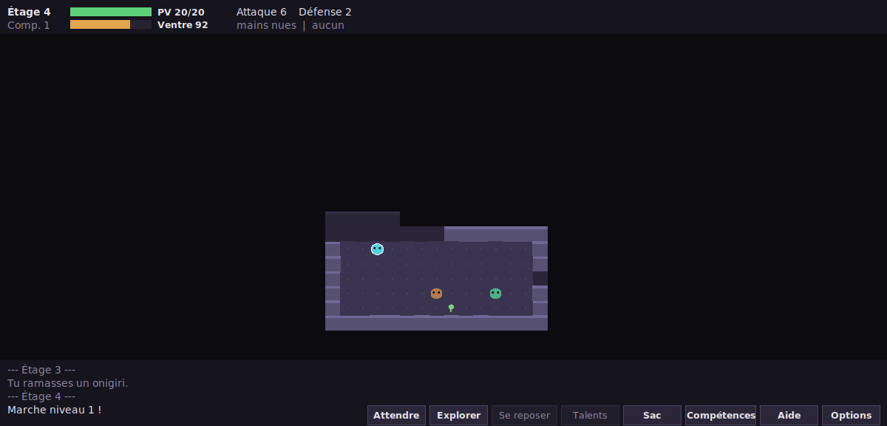
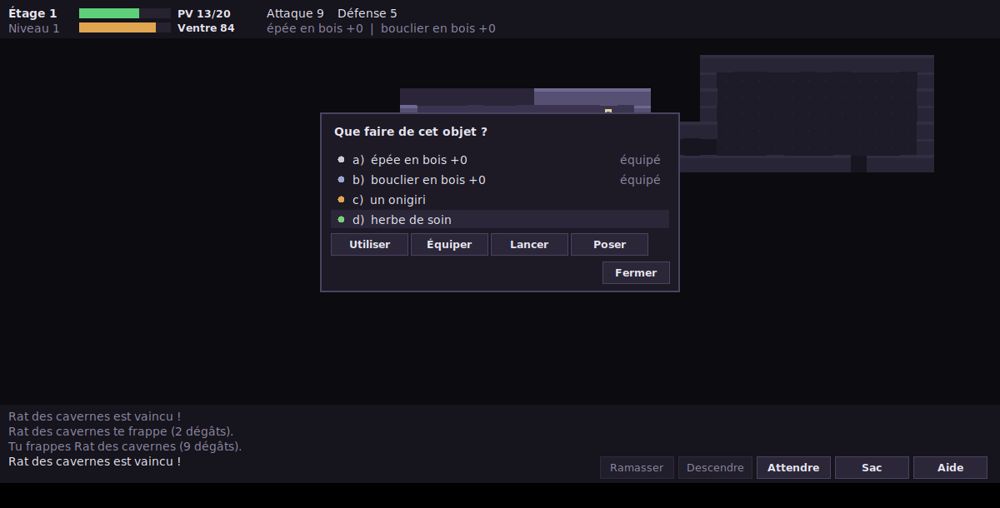
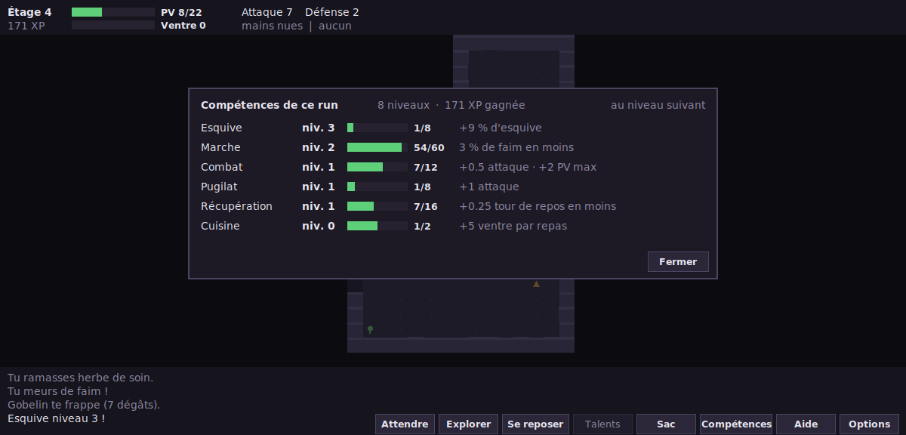
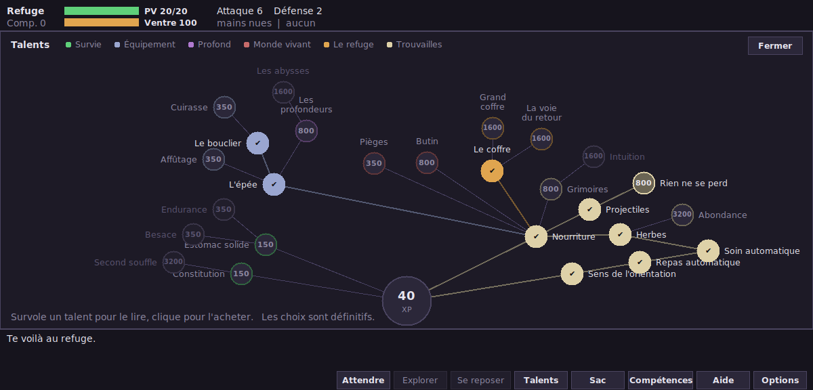

# usedonjon — petit donjon mystère

Un roguelike « Mystery Dungeon » (type *Shiren le vagabond*) doublé d'un
**incrémental** : tour par tour, étages générés, faim, objets à lancer — et un
donjon qui s'ouvre morceau par morceau. La première vie se joue dans un couloir
vide où l'on meurt de faim ; tout le reste s'achète avec ce que la mort
rapporte. Écrit en **Python 3, sans aucune dépendance**.



## Jouer

```bash
python3 -m donjon                # fenêtre graphique (tkinter, fourni avec Python)
python3 -m donjon --seed 42      # partie reproductible
python3 -m donjon --depth 10     # forcer la profondeur (sinon elle s'achète)
python3 -m donjon --tile 26      # cases plus grandes
python3 -m donjon --tui          # version terminal (ASCII, curses)
python3 -m donjon --meta         # voir sa progression permanente
python3 -m donjon --no-save      # jouer sans toucher à la sauvegarde
```

### À la souris

Tout se joue au clic, sans rien connaître du clavier :

- **clic sur une case voisine** : s'y déplacer, ou attaquer ce qui s'y trouve ;
- **clic plus loin** : le héros s'y rend tout seul (chemin calculé par le BFS de
  `path.py`, uniquement à travers ce qu'il a déjà vu) et s'arrête dès qu'un
  monstre apparaît, qu'il est blessé ou qu'il marche sur quelque chose ;
- **clic sur le héros** : ce que la case demande — ramasser, descendre, ouvrir
  le coffre, lire la stèle des talents, ou attendre faute de mieux. Les
  consommables se ramassent tout seuls en marchant dessus ;
- **bouton « Se reposer »** : patienter jusqu'à guérison, au prix du ventre —
  l'attente s'interrompt seule si un monstre paraît ;
- **survol** : une étiquette décrit la case (nom et PV du monstre, objet, piège) ;
- **clic droit** : annuler le déplacement en cours ou fermer un panneau ;
- les **boutons en bas à droite** et le **sac** sont entièrement cliquables — y
  compris viser un jet en cliquant la cible. Le premier bouton est le seul
  bouton d'action : son libellé dit ce qu'il fera ici. Dans le sac, un
  **double-clic** exécute l'action évidente — un onigiri se mange, une épée
  s'équipe.



Les compétences se consultent d'un clic ou avec `c` :



### Au clavier

Les **flèches** (ou `hjkl` + `yubn`, ou le pavé numérique) pour se déplacer et
attaquer, `,` ramasser, `>` descendre, `.` attendre, `s` se reposer,
`e` explorer tout seul, `i` sac, `c` compétences, `t` talents (au refuge),
`?` aide, `q` quitter. Dans le sac : la lettre de l'objet, puis `t` lancer
(puis une direction) ou `d` poser. Après la partie, `R` relance une descente.

Il y a deux affichages pour le même moteur : la fenêtre graphique (`gui.py`,
formes dessinées à la main, prête à recevoir des sprites PNG) et le terminal
(`ui.py`, ASCII). Aucun des deux ne contient de règle de jeu.

### Sous Windows

**Le plus simple : double-clique `jouer.bat`.** Il se place tout seul dans le
bon dossier et lance le jeu — pas de ligne de commande, et pas d'erreur
« No module named donjon ».

En ligne de commande, `python -m donjon` suffit aussi, à condition d'être dans
le dossier **qui contient** le dossier `donjon` (celui où se trouve ce README).
Si tu vois `No module named donjon`, tape `dir` : tu dois voir `donjon` et
`README.md` dans la liste ; sinon, descends d'un cran avec `cd`.

tkinter est livré avec l'installeur officiel de python.org, donc rien à
installer. Seul le mode `--tui` demande en plus `pip install windows-curses`.

Sur Mac et Linux, `./jouer.sh` fait la même chose.

## Tester vite

Tout le jeu est pilotable sans interface : l'UI et les tests appellent les
mêmes fonctions `Game.cmd_*`.

```bash
python3 -m unittest discover -s tests      # la suite complète (~12 s, 330 tests)
python3 -m donjon --seed 7 --script "lljj,>" --frames   # rejouer une partition
python3 -m donjon --seed 7 --auto 500 --reveal          # bot + carte dévoilée
```

Langage de script : `hjklyubn` déplacement, `.` attendre, `,` ramasser,
`>` escalier, `U<slot>` utiliser, `E<slot>` équiper, `D<slot>` poser,
`T<slot><dir>` lancer, `#` commentaire. Les emplacements vont de `a` à `l`
(majuscules pour les objets afin de ne pas gêner `u` = diagonale haut-droite).

Une graine fixe rejoue exactement la même partie : les tests de régression
comparent simplement les journaux et les cartes.

Les tests d'interface (clavier et souris) construisent une vraie fenêtre et lui
envoient des évènements ; ils s'ignorent tout seuls si tkinter ou un écran
manquent, donc la suite reste verte sur un serveur sans affichage.

## Ce qui est déjà là

**Le donjon** — étages générés (salles + couloirs), visibilité « salle
entière » et mémoire de la carte, faim, pièges, escalier. Il s'achète par
tranches de dix étages, et chaque tranche franchie fait monter les créatures
d'un cran sec : la profondeur est un escalier, pas une pente.

**Le combat** — tour par tour sur un ordonnanceur à énergie (vitesses
différentes), diagonales bloquées par les angles de murs pour les coups comme
pour les pas, jet d'objets, tir des archers en ligne droite, statuts avec durée.

**Les créatures** — 13, au croisement de 3 **familles** (animal, humanoïde,
homoncule : ce qu'elles sont) et de 6 **classes** (rôdeur, erratique, embusqué,
guerrier, archer, blindé : ce qu'elles font). Elles laissent du butin sur les
mêmes axes — la classe lâche son outil, la famille sa matière.

**Les objets** — 15 : vivres, herbes, parchemins non identifiés, armes,
boucliers, pierres à lancer, l'orbe de retour. Les munitions s'empilent, les
consommables se ramassent en marchant dessus, et les fiches au survol
annoncent ce que l'objet fera *dans ces mains-là*, compétences comprises.

**Les compétences** — 12, gagnées en pratiquant : marcher entraîne la marche,
frapper entraîne l'arme en main, encaisser entraîne le bouclier — ou l'esquive
si le bras est nu. Elles sont perdues à la mort.

**Le méta** — un refuge où l'on marche, son coffre, sa stèle des talents ;
24 nœuds (32 achats avec les reprises) répartis en 6 branches, dont une
réanimation et deux automatisations (explorer un étage, manger sans y penser).

**Les interfaces** — fenêtre tkinter entièrement jouable à la souris, terminal
curses, et aucune interface du tout pour les tests et le bot.

## Ce que valent les nombres

Rien n'est réglé à l'estime : chaque nœud est mesuré par des campagnes du bot
(`autoplay`), et le critère est simple — **après chaque achat, l'XP par vie doit
monter**. Il a déjà condamné deux nœuds qui n'apportaient que du danger.

Repères actuels, arbre complet acheté, 40 vies :

| | |
|---|---|
| étage atteint | 10,4 en moyenne, 19 au mieux |
| premier palier (étage 11) franchi | une vie sur deux |
| cause de mort | la faim une fois sur deux, sinon les homoncules |

Le bot est un instrument, pas un joueur : il fuit ce qu'il ne peut pas battre,
lit un parchemin quand il n'a plus le choix et mange l'herbe de vie, mais il
n'utilise ni graine de sommeil ni tactique de terrain. **Ce qu'il ne sait pas
faire, aucune campagne ne peut l'évaluer** — c'est écrit noir sur blanc dans le
plan à chaque fois que ça compte.

## Architecture

```
donjon/
  config.py     RunConfig : réglages d'une partie (canal vers le futur méta)
  events.py     évènements d'action (socle de l'XP par compétence)
  skills.py     catalogue des compétences, règles de gain, bonus
  run.py        RunSummary : le bilan d'un run terminé
  tree.py       l'arbre des talents : tout le contenu déverrouillable
  meta.py       progression permanente et sa sauvegarde JSON
  session.py    le lien entre les runs (le seul endroit méta + partie)
  rng.py        hasard centralisé et graine → parties reproductibles
  geom.py       positions et 8 directions
  tiles.py      types de cases (table de propriétés)
  dungeon.py    génération d'étage, champ de vision
  path.py       BFS (IA, bot de test, déplacement à la souris)
  entities.py   Actor / Player / Monster, PV, statuts, énergie
  items.py      objets = données + effets enregistrés
  monsters.py   bestiaire = données pures
  traps.py      pièges = données + effets
  ai.py         un comportement = une fonction enregistrée
  game.py       état, ordonnanceur, API d'actions (cmd_*)
  script.py     partitions de commandes + bot (tests rapides)
  gui.py        fenêtre tkinter, souris et clavier (aucune règle de jeu)
  ui.py         affichage curses (aucune règle de jeu)
  __main__.py   CLI
```

Deux choix structurent la suite :

1. **Ordonnanceur à énergie.** Chaque acteur gagne `speed` points par tour de
   monde et agit à 100. Une action pourra coûter 50 (attaque rapide) ou 200
   (incantation) sans toucher au reste.
2. **UI découplée du moteur.** `game.py` n'importe ni `gui.py` ni `ui.py` : les
   trois affichages (fenêtre, terminal, aucun) appellent les mêmes `cmd_*`.
   C'est ce qui a permis d'ajouter la fenêtre graphique sans toucher une seule
   règle de jeu.

## Ajouter du contenu

**Un monstre** — une entrée dans `donjon/monsters.py`, à l'intersection d'une
**famille** (ce qu'elle est) et d'une **classe** (ce qu'elle fait) :

```python
{"key": "ninja", "name": "Ninja", "glyph": "n",
 "famille": "humanoide", "classe": "embusque",
 "hp": 18, "attack": 10, "defense": 4,
 "depth": (4, 99), "weight": 10, "color": "#d0c05b", "shape": "pointu"}
```

Ce qu'elle laisse en tombant vient des mêmes axes : la classe lâche son outil
(l'archer ses flèches), la famille sa matière (l'animal de la viande) — et
jamais ce que le donjon n'a pas encore ouvert.

La famille donne l'allure par défaut et, bientôt, les forces et faiblesses ; la
classe donne le comportement (voir `ai.py`) et le talent qui la réveille.
`glyph` sert au terminal, `color` et `shape` (`rond`, `carre`, `pointu`) à la
fenêtre graphique — les deux derniers sont facultatifs.

**Un objet** — un effet + une entrée dans `donjon/items.py` :

```python
@effect("jet_gel")
def _jet_gel(game, thrower, target, item):
    target.add_status("paralysé", 8)
    game.say(f"{target.name} est pris dans la glace.")
    return True

ItemType("baguette_gel", "baguette de gel", "/", SCROLL, weight=6, on_hit="jet_gel")
```

**Une compétence** — une entrée dans `donjon/skills.py`, plus une règle disant
quel évènement la nourrit :

```python
Skill("hache", "Hache", base=5, scope=EQUIPEMENT, effects={"attaque": 2})
```

Une arme de cette famille se déclare avec `skill="hache"` dans `items.py` : la
règle `"@arme"` fait le reste, le moteur n'est pas touché. Un objet d'une
catégorie déjà connue (herbe, parchemin…) hérite automatiquement de sa
compétence.

**Un comportement d'IA** — une fonction décorée dans `donjon/ai.py` :

```python
@behaviour("voleur")
def _voleur(game, monster):
    ...   # vole un objet puis fuit vers l'escalier
```

**Un piège** — même schéma dans `donjon/traps.py`.

**Un talent** — une entrée dans `donjon/tree.py`, et c'est tout ce qui sépare
une idée de son arrivée dans le jeu :

```python
Noeud("baguettes", "Les baguettes", 90,
      "Des baguettes apparaissent au sol — et des créatures qui savent les "
      "brandir.",
      branche="Trouvailles", parents=("grimoires",),
      unlocks=("baguettes",), classes=("mage",),
      effets={"items_per_floor": (1, 1)})
```

`effets` s'ajoutent à la `RunConfig`, `reglages` la remplacent, `objets`
garnissent le sac de départ, `unlocks` ouvrent des familles d'objets, `classes`
réveillent des créatures, et `repetitions` / `facteur_cout` en font un nœud
qu'on reprend, de plus en plus cher. L'éventail se réorganise tout seul autour
du nouveau venu.

## Le refuge et les deux boucles

La partie s'ouvre dans un **refuge** : une petite salle où l'on marche, avec la
stèle des talents, un coffre et l'escalier du donjon. Ce qu'on laisse dans le
coffre survit à la mort. Le refuge n'entraîne rien — sans faim ni monstre, on y
ferait des ronds pour monter la marche : on y dépense, on n'y gagne pas.

Deux boucles s'y imbriquent :

- **mourir** — on perd sac et compétences, mais l'XP permanente tombe, et la
  descente suivante part sur un donjon un peu plus ouvert ;
- **l'orbe de retour**, trouvée à partir de l'étage 4 — on remonte au refuge
  avec tout, sac et compétences comprises, mais la descente ne rapporte
  **aucune** progression permanente et la profondeur repart de zéro. On est plus
  fort pour descendre plus bas, à condition d'y arriver vraiment.

## L'arbre des talents

Le jeu **se déverrouille**. La première vie se joue dans un couloir vide où
l'on meurt de faim : pas d'arme, pas de monstre, rien au sol. Mourir rapporte
de l'XP permanente — **toute l'XP de compétences gagnée pendant la vie**,
multipliée par la profondeur atteinte — et cette XP s'échange contre des
talents, à la stèle du refuge.

Ce que ça change : un cran arraché ne vaut pas un cran offert. Les courbes
étant géométriques, monter « épée » du niveau 5 au niveau 6 demande 38 XP là où
le premier cran en demandait 5 ; la récompense suit, sans qu'aucune table de
conversion n'existe. Compter les niveaux, comme avant, revenait à payer les
deux le même prix — et le gain d'une vie plafonnait quoi qu'on fasse.

L'équipement, les créatures, les objets, les herbes, les parchemins, le coffre,
l'orbe, les étages eux-mêmes : chacun est un nœud à acheter, avec ses
prérequis. Les choix sont définitifs, mais certains nœuds se **reprennent**, de
plus en plus cher. Chaque déblocage augmente ce qu'une vie rapporte, donc
accélère le suivant.

La nourriture ne descend jamais sous 30 % des trouvailles, quel que soit le
nombre de familles d'objets débloquées — sans ce plancher, acheter du contenu
noierait les vivres et ferait mourir de faim. C'est un plancher statistique, pas
un vivre posé d'office : quatre étages sur dix n'en portent aucun.

**On n'achète jamais des monstres.** Un nœud donne un outil, et le donjon
apprend le même geste : la nourriture attire les bêtes, l'épée fait venir ce qui
se bat au contact, le bouclier ce qui encaisse, les projectiles ce qui te vise
de loin. La menace qu'un achat réveille est ce qui rend le suivant désirable —
et le critère est mesuré : après chaque nœud, l'XP par vie doit monter.

Le donjon lui-même s'achète **par tranches de dix étages**, et chaque tranche
franchie fait monter les créatures d'un cran sec — ×1,54 au dixième étage,
×2,32 au onzième. Ouvrir la suite du donjon se sent au premier pas.

L'arbre s'affiche en éventail : au centre l'XP qu'il reste à dépenser, autour
les branches qui s'ouvrent en rayons, un cran plus loin du centre par prérequis.
Un rond plein est acquis, un rond vif s'achète, un rond éteint attend ses
prérequis ; le survol en donne l'effet et le prix.



Ajouter du contenu, c'est un nœud dans `tree.py` et un `unlock="..."` sur les
objets concernés — le moteur ne bouge pas. La sauvegarde vit dans
`~/.usedonjon/meta.json`.

## Repartir de zéro

Le bouton **Options** du bas de l'écran contient « Repartir de zéro » : il
efface l'XP, les talents et le coffre, et le donjon redevient le couloir vide
de la première vie. Deux clics sont nécessaires — c'est le seul geste
destructeur du jeu. La sauvegarde vit dans `~/.usedonjon/meta.json` ; la
supprimer à la main revient au même.

## Où va le projet

L'hybride roguelike / incrémental est en place : on progresse dans ce qu'on
pratique, on perd tout à la mort, et ce qu'on y gagne rouvre le jeu un nœud à
la fois. Le plan détaillé, la frontière entre état de run et état permanent, et
**toutes les décisions avec leurs mesures** — y compris celles que les chiffres
ont fait changer d'avis — sont dans
[`docs/plan-incremental.md`](docs/plan-incremental.md).

## Pistes pour la suite

- **Forces et faiblesses par famille** : le métal encaisse le tranchant et
  redoute le contondant, la chair l'inverse — l'axe qui donnera tout son sens
  aux homoncules, et une raison de porter deux armes
- **Les baguettes**, et le mage qui va avec (il fait des dégâts à distance :
  aucun monstre ne prend le contrôle du héros, c'est une règle)
- **L'arc**, en amélioration du nœud des projectiles — les flèches attendent
  déjà, on ne les trouve que sur un archer
- Nourritures spéciales et améliorations de satiété, derrière « Nourriture »
- Marmites / fusion d'objets, malédictions, objets scellés
- Missions à contraintes (sans objet, étages spéciaux, salles de monstres)
- Sauvegarde de partie (l'état est déjà sérialisable sans effort)
- Sprites PNG dans la fenêtre (le dessin passe déjà par une fonction par forme)
